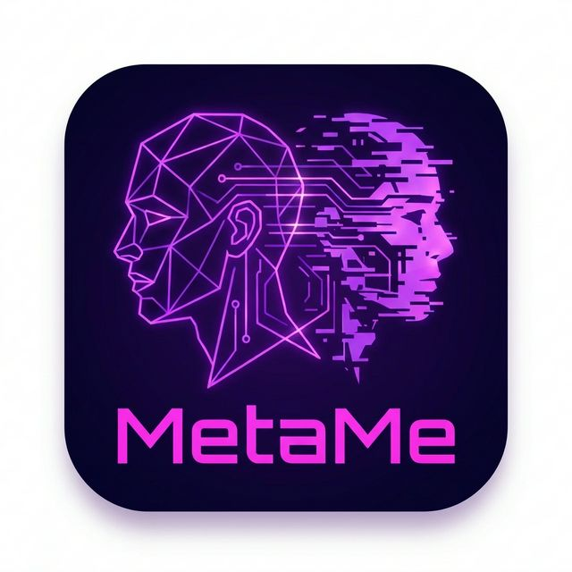

# MetaMe

<p align="center">
  
</p>

<p align="center">
  <a href="https://www.npmjs.com/package/metame-cli"></a>
  <a href="https://www.npmjs.com/package/metame-cli"></a>
  <a href="https://github.com/Yaron9/MetaMe/blob/main/LICENSE"></a>
</p>

<p align="center">
  <a href="./README.md">English</a> | <a href="./README中文版.md">中文</a>
</p>

> **Your digital twin. Lives on your machine.**

MetaMe is an AI that lives on your machine — remembers how you think, stays online 24/7, and takes commands from your phone via Telegram or Feishu. Not in the cloud. In your computer. Runs natively on macOS and Windows.

No cloud. Your machine, your data.

```bash
curl -fsSL https://raw.githubusercontent.com/Yaron9/MetaMe/main/install.sh | bash
```

---

> ### 🚀 v1.5.10 — Perpetual Task Engine & Agent Soul Layer
>
> - **Perpetual task engine**: Any project can run as a 24/7 autonomous agent loop with event sourcing, verifier gates, budget/depth control, and reconciliation. Domain-agnostic — works for research, code auditing, documentation, anything. Configure with `reactive: true` and an optional `perpetual.yaml`.
> - **Cross-device dispatch**: Team members can run on remote machines. Add `peer: windows` to a member and messages route automatically via a Feishu relay chat — HMAC-signed, dedup-protected, zero manual routing.
> - **`/dispatch peers`**: View remote dispatch config, relay chat, and all remote team members from mobile.
> - **`dispatch_to peer:project`**: Dispatch tasks to remote peers from CLI, admin commands, or Claude sessions.
> - **Unified team dispatch**: Shared `team-dispatch.js` module — single source of truth for project/member resolution, roster hints, and prompt enrichment.
> - **Team broadcast**: Real-time cross-agent visibility in shared group chats with nickname routing and sticky follow.
> - **Unified intent engine**: Config-driven intent dispatcher replacing standalone hooks for team communication, ops assist, and task creation.
> - **Modular agent wizards**: New streamlined CLI flows for creating teams and cloning agents.
> - **Dynamic default engine**: auto-detects installed CLI (claude/codex) at startup; pure-codex users work out of the box with zero config.
> - **Multi-engine runtime adapter**: daemon supports engine routing by project (`project.engine`) with shared execution flow for Claude/Codex.
> - **Mentor mode hooks**: pre-flight emotion breaker, context-time mentor prompt, and post-flight reflection debt registration.
> - **Multi-user ACL**: role-based permissions (admin / member / stranger) with binding protection.
> - **Windows native support**: cross-platform path handling, Named Pipes IPC, GBK-safe encoding.
>
> Zero configuration. It just works.

---

## What It Does

### 1. Knows You Across Every Project

Claude Code forgets you every time you switch folders. MetaMe doesn't.

A cognitive profile (`~/.claude_profile.yaml`) follows you everywhere — not just facts like "user prefers TypeScript", but *how you think*. The profile is built on a **6-dimension soul schema**: Values, Drive, Cognition Style, Stress & Shadow, Relational, and Identity Narrative — 67 fields organized into 4 tiers (T1 locked identity → T5 system-managed evolution). First-time users go through a **Genesis Interview**: a structured deep conversation that builds your cognitive fingerprint from scratch.

Once established, the profile updates silently from your conversations via background distillation — no effort required.

```
$ metame
🧠 MetaMe: Distilling 7 moments in background...
🧠 Memory: 42 facts · 87 sessions tagged
Link Established. What are we building?
```

### 2. Full Claude/Codex Sessions From Your Phone

Your Mac runs a daemon. Your phone sends messages via Telegram or Feishu.
Engine is selected per project (`project.engine: claude|codex`) — same tools, same files, same session continuity.

```
You (phone):  Fix the auth bug in api/login.ts
Claude:       ✏️ Edit: api/login.ts
              💻 Bash: npm test
              ✅ Fixed. 3 tests passing.
```

Start on your laptop, continue on the train. `/stop` to interrupt, `/undo` to rollback, `/mac check` for macOS automation diagnostics, and `/sh ls` for raw shell access when everything else breaks.

### 3. Layered Memory That Works While You Sleep

MetaMe's memory system runs automatically in the background — no prompts, no manual saves. Five layers, fully autonomous.

**Layer 1 — Long-term Facts**
When you go idle, MetaMe runs memory consolidation: extracts key decisions, patterns, and knowledge from your sessions into a persistent facts store. Facts can also carry concept labels (`fact_labels`) for faster cross-domain retrieval.

**Layer 2 — Session Continuity**
Resuming a conversation after 2+ hours? MetaMe injects a brief summary of what you were working on last time — so you pick up where you left off without re-explaining context.

**Layer 3 — Session Index**
Every session gets tagged with topics and intent. This powers future session routing: when you reference "that thing we worked on last week", MetaMe knows where to look.

**Layer 4 — Nightly Reflection**
Every night at 01:00, MetaMe reviews your most-accessed facts from the past week and distills them into high-level decision logs and operational lessons. Distilled outputs are also written back to `memory.db` as `synthesized_insight`, enabling retrieval in future sessions.

**Layer 5 — Memory Index**
At 01:30, an auto-generated global index (`INDEX.md`) maps every memory document across all categories (including capsules and postmortems). This serves as a fast lookup table so MetaMe always knows where to find relevant context.

```
[Background, while you sleep]
idle 30min → memory consolidation triggered
  → session_tags.json updated (topics indexed)
  → facts extracted → ~/.metame/memory.db
  → session summary cached → daemon_state.json
01:00 → nightly reflection: hot facts → decisions + lessons
01:30 → memory index regenerated

[Next morning, when you resume]
"continue from yesterday" →
  [上次对话摘要] Auth refactor, decided on JWT with
  refresh token rotation. Token expiry set to 15min.
```

### 4. Heartbeat — A Programmable Nervous System

Most AI tools react when you talk to them. MetaMe keeps running while you sleep.

The heartbeat system is three-layered:

**Layer 0 — Kernel (always on, zero config)**
Built into the daemon. Runs every 60 seconds regardless of what's in your config:
- Drains the dispatch queue (IPC messages from other agents)
- Tracks daemon aliveness and rotates logs
- Detects when you go idle → generates session continuity summaries

**Layer 1 — System Evolution (built-in defaults)**
Five tasks shipped out of the box. They are precondition-gated and run only when useful:

```yaml
- cognitive-distill   # 4h · has signals? → distill preferences into profile
- memory-extract      # 4h · scan sessions → extract long-term facts + concept labels
- skill-evolve        # 6h · has signals? → evolve skills from task outcomes
- nightly-reflect     # 01:00 daily · hot facts → decisions/lessons + synthesized facts + capsules
- memory-index        # 01:30 daily · regenerate global memory index
```

`precondition` guards mean zero tokens burned when there's nothing to process.

**Layer 2 — Your Tasks (fully customizable)**
Anything you want Claude to do on a schedule, per project, with push notifications:

```yaml
projects:
  my_blog:
    heartbeat_tasks:
      - name: "daily-draft"
        prompt: "Research top AI news and write an article"
        at: "09:30"
        days: "weekdays"
        model: "sonnet"
        notify: true

heartbeat:
  tasks:
    - name: "morning-brief"
      prompt: "Summarize my git activity from yesterday"
      at: "09:00"
      notify: true
```

Chain skills into multi-step workflows — research → write → publish — fully automated:

```yaml
    - name: "daily-content"
      type: "workflow"
      steps:
        - skill: "deep-research"
          prompt: "Top 3 AI news today"
        - skill: "tech-writing"
          prompt: "Write an article from the research above"
        - skill: "wechat-publisher"
          prompt: "Publish it"
```

**Task options:**

| Option | Description |
|--------|-------------|
| `at` | Fixed-time trigger, e.g. `"09:30"` (local time) |
| `days` | Day filter, e.g. `"weekdays"`, `[mon, wed, fri]` |
| `interval` | Interval trigger, e.g. `"4h"`, `"30m"` |
| `require_idle` | Skip if you're active; retry on next heartbeat tick |
| `precondition` | Shell guard — skip task if command returns non-zero (zero tokens consumed) |
| `notify` | Push result to phone when done |
| `model` | Override model, e.g. `"sonnet"`, `"haiku"` |
| `cwd` | Working directory for the task |
| `timeout` | Max run time |

> **Scheduled tasks require the daemon to be running.** On macOS, `metame start` auto-registers with launchd (auto-restart on crash/reboot). On Windows, run `metame daemon install-task-scheduler`. Tasks fire on schedule even with the screen locked — as long as the machine is on.

### 5. Perpetual Task Engine — Agents That Never Stop

Any project can run as an autonomous perpetual loop. The daemon drives the cycle: agent acts → verifier gates → event log records → next dispatch. Domain-agnostic — research, code auditing, documentation, anything.

**How it works:**

```yaml
# daemon.yaml — register a perpetual project
scientist:
  name: Research Director
  reactive: true          # enables perpetual lifecycle
  cwd: ~/AGI/AgentScientist
  team:
    - key: sci_scout
      name: Literature Scout
      cwd: ~/AGI/AgentScientist/team/scout
```

**What the platform provides (zero project-specific code in MetaMe):**
- **Event sourcing**: All state changes logged to `~/.metame/events/<key>.jsonl` — single source of truth, daemon-exclusive writes
- **Budget & depth gates**: Auto-pause when token budget or loop depth exceeded
- **Verifier hooks**: Project scripts validate phase completion with objective checks (file existence → structure checks → API verification)
- **Reconciliation**: Heartbeat detects stale projects and notifies you
- **`/status perpetual`**: See all running projects — phase, depth, mission, last activity

**Convention over configuration**: Drop a `scripts/verifier.js` in your project and it just works. Need custom signals? Add a `perpetual.yaml`:

```yaml
# perpetual.yaml — optional, override defaults
completion_signal: RESEARCH_COMPLETE
verifier: scripts/research-verifier.js
max_depth: 50
```

```
Agent output → daemon parses signals
  → budget gate → depth gate → verifier gate
  → event logged → state file regenerated
  → next dispatch (fresh session) OR mission complete
  → archive → next mission from queue → repeat
```

### 6. Skills That Evolve Themselves

MetaMe's current skill loop is queue-driven and reviewable (not magic black-box automation).

- **Signal capture**: task outcomes and failures are captured into evolution signals.
- **Hot/cold evolution**: `skill-evolution` runs on task hot path and heartbeat cold path.
- **Workflow proposals**: repeated multi-tool patterns are merged into workflow sketches and queued as proposals.
- **Human approval gate**: review and operate with `/skill-evo list`, `/skill-evo approve <id>`, `/skill-evo done <id>`, `/skill-evo dismiss <id>`.
- **Skill manager fallback**: when capability is missing, runtime routes to `skill-manager` skill guidance instead of blind guessing.

```
task outcome/failure → skill signal buffer
                     → hot/cold evolution
                     → proposal queue
                     → /skill-evo approve|done|dismiss
```

---

## Install

MetaMe is the orchestration layer. Claude Code and Codex are the engines. You install them together.

### One-liner by user type

| You use | Install command | First login |
|---------|----------------|-------------|
| **Claude Code** | `npm install -g @anthropic-ai/claude-code metame-cli` | `claude` |
| **Codex** | `npm install -g @openai/codex metame-cli` | `codex login` |
| **Both** | `npm install -g @anthropic-ai/claude-code @openai/codex metame-cli` | `claude` + `codex login` |
| **Claude plugin** (no npm) | `claude plugin install github:Yaron9/MetaMe/plugin` | `claude` |

> **No Node.js?** Run `curl -fsSL https://raw.githubusercontent.com/Yaron9/MetaMe/main/install.sh | bash` — it installs Node + MetaMe for you.
>
> **Windows?** Use PowerShell/CMD natively. WSL has proxy and path issues.

### Setup (3 minutes)

| Step | What to do |
|------|-----------|
| 1. Launch | `metame` (Claude) or `metame codex` (Codex) |
| 2. Genesis Interview | Just chat — MetaMe auto-starts a deep soul interview on first run → builds `~/.claude_profile.yaml` |
| 3. Connect phone | Say "help me set up mobile access" → interactive Telegram/Feishu bot wizard |
| 4. Start daemon | `metame start` → background daemon launches, bot goes online |
| 5. Register with OS | macOS: automatic (step 4 registers with launchd) · Windows: `metame daemon install-task-scheduler` |

> **First time?** Just run `metame` and talk naturally. Everything is conversational.

### Create your first Agent

1. In any existing group, say: `Create an agent, directory ~/xxx, responsible for xxx`
2. Bot replies: Agent created — **send `/activate` in your new group to bind it**
3. Create a new group, add the bot, send `/activate` → binding complete

> Want more Agents? Repeat the flow. Each group = independent AI workspace.

### Update / Uninstall

```bash
# Update
npm install -g metame-cli

# Uninstall
metame stop && npm uninstall -g metame-cli

# Optional: remove data
rm -rf ~/.metame ~/.claude_profile.yaml
```

Optional service cleanup:
- macOS: `launchctl bootout gui/$(id -u)/com.metame.npm-daemon && rm -f ~/Library/LaunchAgents/com.metame.npm-daemon.plist`
- Windows: `schtasks /delete /tn "MetaMe-Daemon" /f`
- Linux/WSL: `systemctl --user disable --now metame && rm -f ~/.config/systemd/user/metame.service`

### Platform notes

<details>
<summary>Windows</summary>

- Emoji auto-degrades to ASCII (`[OK]`, `[FAIL]`) for GBK compatibility
- IPC uses Named Pipes instead of Unix sockets
- `/mac` commands are not available
- **Install natively in PowerShell/CMD, not via WSL**
</details>

<details>
<summary>WSL2 / Linux — systemd registration</summary>

```bash
cat > ~/.config/systemd/user/metame.service << 'EOF'
[Unit]
Description=MetaMe Daemon
After=network.target

[Service]
ExecStart=/usr/bin/env metame start
Restart=on-failure
RestartSec=5

[Install]
WantedBy=default.target
EOF

systemctl --user enable metame
systemctl --user start metame
```

> Requires systemd enabled: add `[boot]\nsystemd=true` to `/etc/wsl.conf`, then restart WSL.

</details>

### FAQ

- **Does plugin mode support daemon + phone?** Yes. Plugin auto-starts daemon when `daemon.yaml` exists.
- **Does MetaMe bundle Claude or Codex?** No. `metame-cli` is engine-agnostic — you install engine(s) separately.
- **One engine only?** Works fine. `/doctor` marks the missing engine as warning, not failure.

---

## Core Capabilities

| Capability | What It Does |
|-----------|-------------|
| **Cognitive Profile** | 6-dimension soul schema (Values, Drive, Cognition Style, Stress & Shadow, Relational, Identity Narrative). 67 fields, tier-locked, 800-token budget. First-time Genesis Interview builds your profile from scratch. |
| **Layered Memory** | Five-tier memory: long-term facts (+ concept labels), session summaries (continuity bridge), session index (topic tags), nightly reflection (distill + write-back), memory index (global lookup). All automatic. |
| **Mobile Bridge** | Full Claude/Codex via Telegram/Feishu. Stateful sessions, file transfer both ways, real-time streaming status. |
| **Skill Evolution** | Queue-driven skill evolution: captures task signals, generates workflow proposals, and supports explicit approval/resolve via `/skill-evo` commands. |
| **Token Budget** | Daily token usage tracking with per-category breakdown. Configurable daily limit, automatic 80% warning threshold, usage history with rollover. |
| **Auto-Provisioning** | First run deploys default CLAUDE.md, documentation, and runtime copies under `~/.metame/`. Subsequent runs redeploy generated runtime files without overwriting user config in `~/.metame/daemon.yaml`. |
| **Heartbeat System** | Three-layer programmable nervous system. Layer 0 kernel always-on (zero config). Layer 1 system evolution built-in (5 tasks: distill + memory + skills + nightly reflection + memory index). Layer 2 your custom scheduled tasks with `require_idle`, `precondition`, `notify`, workflows. |
| **Multi-Agent** | Multiple projects with dedicated chat groups. `/agent bind` for one-tap setup. True parallel execution. |
| **Team Routing** | Project-level team clones: multiple AI agents work in parallel within a single chat group. Nickname routing, sticky follow, `/stop` per member, broadcast visibility. |
| **Cross-Device Dispatch** | Team members can run on different machines. `member.peer` marks remote agents — messages route via a Feishu relay chat with HMAC-SHA256 signing and 5-minute TTL dedup. `/dispatch peers` to view config, `dispatch_to peer:project` for explicit routing. |
| **Browser Automation** | Built-in Playwright MCP. Browser control out of the box for every user. |
| **Cross-Platform** | Native support for macOS and Windows. Platform abstraction layer handles spawn, IPC, process management, and terminal encoding automatically. |
| **Provider Relay** | Route through any Anthropic-compatible API. Use GPT-4, DeepSeek, Gemini — zero config file mutation. |
| **Metacognition** | Detects behavioral patterns (decision style, comfort zones, goal drift) and injects mirror observations. Zero extra API cost. |
| **Mentor Mode** | `/mentor on|off|level|status` controls friction mode. Emotion breaker, zone-adaptive mentor prompts, and reflection debt run as optional hooks. |
| **Multi-User ACL** | Role-based permission system (admin / member / stranger). Share bots with teammates safely. Dynamic user management via `/user` commands with hot-reload config. |
| **Team Task** | Multi-agent task board for cross-agent collaboration. Agents can create, assign, and track tasks across workspaces. N-agent session scoping for parallel team workflows. |
| **Emergency Tools** | `/doctor` diagnostics, `/mac` macOS control helpers, `/sh` raw shell, `/fix` config restore, `/undo` git-based rollback. |

## Defining Your Agents

MetaMe's design philosophy: **one folder = one agent.**

Give an agent a directory, drop a `CLAUDE.md` inside describing its role, and you're done. The folder is the agent — it can be a code project, a blog repo, any workspace you already have.

### Option 1: Just say it (recommended)

No commands needed. Tell the bot what you want in plain language. **The agent is created without binding to the current group** — send `/activate` in your new target group to complete the binding:

```
You:  Create an agent, directory ~/projects/assistant, responsible for writing and content
Bot:  ✅ Agent「assistant」created
      Dir: ~/projects/assistant
      📝 CLAUDE.md written

      Next: send /activate in your new group to bind

── In the new group ──

You:  /activate
Bot:  🤖 assistant bound
      Dir: ~/projects/assistant

You:  Change this agent's role to: focused on Python backend development
Bot:  ✅ Role definition updated in CLAUDE.md

You:  List all agents
Bot:  📋 Agent list
      🤖 assistant ◀ current
      Dir: ~/projects/assistant
      ...
```

Supported intents: create, bind (`/agent bind`), unbind, edit role, list — just say it naturally.

### Option 2: Commands

Use `/agent` commands in any Telegram/Feishu group:

| Command | What it does |
|---------|-------------|
| `/activate` | In a new group, sends this to auto-bind the most recently created pending agent. |
| `/agent bind <name> [dir]` | Manual bind: register this group as a named agent. Works anytime — no need to recreate if agent already exists. |
| `/agent list` | Show all configured agents. |
| `/agent edit` | Update the current agent's role description (rewrites its `CLAUDE.md` section). |
| `/agent unbind` | Remove this group's agent binding. |
| `/agent reset` | Remove the current agent's role section. |

> **Binding protection**: Each group can only be bound to one agent. Existing bindings cannot be overwritten without explicit `force:true`.

### From config file (for power users)

```yaml
# ~/.metame/daemon.yaml
projects:
  assistant:                      # project key — used by dispatch_to
    name: "Personal Assistant"
    icon: "💅"
    color: "blue"
    cwd: "~/AGI/MyAssistant"
    nicknames: ["小美", "助理"]
    heartbeat_tasks: []

  coder:
    name: "Backend Engineer"
    icon: "🛠"
    color: "orange"
    cwd: "~/projects/backend"
    heartbeat_tasks:
      - name: "daily-review"
        prompt: "Review yesterday's commits and flag any issues"
        at: "20:30"
        days: [mon, tue, wed, thu, fri]
        notify: true

feishu:
  chat_agent_map:
    oc_abc123: assistant          # this group → assistant agent
    oc_def456: coder              # this group → coder agent
```

All agents share your cognitive profile (`~/.claude_profile.yaml`) — they all know who you are. Each runs in its own `cwd` with its own Claude session, in parallel.

**Dispatch between agents** (from Claude or a heartbeat task):

```bash
~/.metame/bin/dispatch_to assistant "Schedule tomorrow's standup"
~/.metame/bin/dispatch_to coder "Run the test suite and report results"
```

## Team Routing

MetaMe supports project-level team clones — multiple AI agents (digital twins) sharing the same workspace, working in parallel within a single Feishu group. Team members can run locally or on remote machines.

### Configuration

Add a `team` array and `broadcast: true` under any project in `daemon.yaml`:

```yaml
projects:
  metame:
    name: 超级总管 Jarvis
    icon: 🤖
    broadcast: true
    team:
      - key: jia
        name: Jarvis · 甲
        icon: 🤖
        color: green
        cwd: ~/AGI/MetaMe
        nicknames:
          - 甲
        auto_dispatch: true
      - key: hunter
        name: 猎手
        icon: 🎯
        peer: windows            # runs on another machine
        nicknames:
          - 猎手
```

### Key Features

- **Nickname routing**: mention a member by nickname (e.g. "乙 check this") to route directly to them
- **Sticky follow**: once you address a member, subsequent messages without a nickname continue going to the same member
- **`/stop` precision**: `/stop 乙` stops a specific member; `/stop` stops the sticky member; reply-quote `/stop` stops the quoted member
- **Auto-dispatch**: when the main agent is busy, messages are automatically routed to idle `auto_dispatch` members
- **Broadcast**: with `broadcast: true`, inter-member `dispatch_to` messages are shown as cards in the group chat
- **Cross-device members**: add `peer: <device>` to a team member — messages route via a Feishu relay chat with HMAC signing and dedup protection

Each team member runs on a virtual chatId (`_agent_{key}`) and appears with its own card title (e.g. `🤖 Jarvis · 乙`).

### Cross-Device Dispatch

Team members with `peer` field run on a different machine. Configure `feishu.remote_dispatch` on both machines with the same relay chat and shared secret, but do not share the same Feishu bot between machines. Each machine must use its own Feishu app/bot credentials.

```yaml
feishu:
  remote_dispatch:
    enabled: true
    self: mac                  # unique peer name per machine
    chat_id: oc_relay_xxx      # shared relay group
    secret: shared-secret-key  # HMAC signing key
```

Why separate bots are required:
- Feishu may deliver relay-chat events to either online client for the same bot.
- Current remote-dispatch handling drops packets addressed to a different `self` peer.
- If Windows and Mac share one bot, the wrong machine can consume and discard the packet.

Use from mobile: `/dispatch to windows:hunter research competitors` or just mention by nickname — routing is automatic. Use `/dispatch peers` to check remote config status.

## Mobile Commands

| Command | Action |
|---------|--------|
| `/continue` | Sync to computer's current work (session + directory) |
| `/last` | Resume most recent session |
| `/new` | Start new session (project picker) |
| `/resume` | Pick from session list |
| `/stop` | Interrupt current task (ESC) |
| `/undo` | Show recent messages as buttons — tap to roll back context + code to before that message |
| `/undo <hash>` | Roll back to a specific git checkpoint |
| `/list` | Browse & download project files |
| `/model` | Switch model (sonnet/opus/haiku) |
| `/engine` | Show/switch default engine (`claude`/`codex`) |
| `/distill-model` | Show/update background distill model (default: `haiku`) |
| `/mentor` | Mentor mode control: on/off/level/status |
| `/activate` | Activate and bind the most recently created pending agent in a new group |
| `/agent new` | Interactive wizard to create a new agent |
| `/agent new team` | Team wizard: create multiple parallel agent clones under a project |
| `/agent new clone` | Clone wizard: create a clone sharing the current agent's role |
| `/agent bind <name> [dir]` | Manually register group as dedicated agent |
| `/agent soul repair` | Idempotent rebuild of agent soul layer (links SOUL.md / MEMORY.md) |
| `/msg <agent> <message>` | Send a direct message to a team member or agent (e.g. `/msg 乙 check this`) |
| `/broadcast [on\|off]` | Toggle team broadcast for the current project (show inter-agent dispatches as cards) |
| `/stop <nickname>` | Stop a specific team member (e.g. `/stop 乙`) |
| `/mac` | macOS control helper: permissions check/open + AppleScript/JXA execution |
| `/sh <cmd>` | Raw shell — bypasses Claude |
| `/memory` | Memory stats: fact count, session tags, DB size |
| `/memory <keyword>` | Search long-term facts by keyword |
| `/doctor` | Interactive diagnostics |
| `/user add <open_id>` | Add a user (admin only) |
| `/user role <open_id> <admin\|member>` | Set user role |
| `/user list` | List all configured users |
| `/user remove <open_id>` | Remove a user |
| `/sessions` | Browse recent sessions with last message preview |
| `/dispatch peers` | View remote dispatch configuration and remote team members |
| `/dispatch to <target> <prompt>` | Dispatch task to agent or remote peer (`peer:project` format supported) |
| `/teamtask create <agent> <goal>` | Create a cross-agent collaboration task |
| `/teamtask` | List recent TeamTasks (last 10) |
| `/teamtask <task_id>` | View task detail |
| `/teamtask resume <task_id>` | Resume a task |

## Weixin Direct Bridge

MetaMe also supports a direct Weixin bridge. It is separate from WeCom and currently optimized for text-only request/response flows.

### Enable and bind

1. Edit `~/.metame/daemon.yaml` and enable the bridge:

```yaml
weixin:
  enabled: true
  base_url: "https://ilinkai.weixin.qq.com"
  bot_type: "3"
  account_id: ""
  route_tag: null
  allowed_chat_ids: []
  chat_agent_map: {}
  poll_timeout_ms: 35000
```

2. Redeploy or restart MetaMe so the runtime picks up the new config.
3. In your admin chat, run `/weixin login start` to generate the login QR/link.
4. Scan and confirm with Weixin, then run `/weixin login wait --session <key>`.
5. Run `/weixin` or `/weixin status` to verify the account is linked.

Natural-language setup is available through the intent hook. If you want the model to expose the setup flow on demand, enable this in `~/.metame/daemon.yaml`:

```yaml
hooks:
  weixin_bridge: true
```

Then prompts like “帮我配置微信桥接” or “开始微信扫码登录” will inject the enable-and-bind workflow for the model.

## Mentor Mode (Why + How)

Mentor Mode is designed for users who want MetaMe to actively improve decision quality, not just execute commands.

- `/mentor on` — enable mentor hooks
- `/mentor off` — disable mentor hooks
- `/mentor level <0-10>` — set friction level
- `/mentor status` — show current mode/level

Runtime behavior:
- Pre-flight emotion breaker (cooldown-aware)
- Context-time mentor prompts (zone-aware: comfort/stretch/panic)
- Reflection debt registration on heavy code outputs (intense mode)

Level mapping:
- `0-3` → `gentle`
- `4-7` → `active`
- `8-10` → `intense`

## Hook Optimizations (Default On)

MetaMe installs and maintains core Claude hooks automatically on launch:

- `UserPromptSubmit` hook (`scripts/hooks/intent-engine.js`): Unified intent engine for team dispatch, ops assist, and task creation hints.
- `UserPromptSubmit` hook (`scripts/signal-capture.js`): captures high-signal preference/task traces with layered filtering.
- `Stop` hook (`scripts/hooks/stop-session-capture.js`): records session-end/tool-failure signals with watermark protection.

If hook installation fails, MetaMe logs and continues the session (non-blocking fallback).

## How It Works

```
┌─────────────┐     Telegram/Feishu      ┌──────────────────────────────┐
│  Your Phone  │ ◄──────────────────────► │   MetaMe Daemon (Mac)        │
└─────────────┘                           │   (your machine, 24/7)       │
                                          │                              │
                                          │   ┌──────────────┐           │
                                          │   │ Claude/Codex  │           │
                                          │   │ (same runtime)│           │
                                          │   └──────────────┘           │
                                          │                              │
                                          │   ~/.claude_profile          │
                                          │   ~/.metame/memory.db        │
                                          │   dispatch_to (auto-deployed)│
                                          └──────────┬───────────────────┘
                                                     │
                                          ┌──────────▼───────────────────┐
                                          │   Feishu Relay Chat          │
                                          │   (HMAC-signed packets)      │
                                          └──────────┬───────────────────┘
                                                     │
                                          ┌──────────▼───────────────────┐
                                          │   MetaMe Daemon (Windows)    │
                                          │   peer: "windows"            │
                                          │   Remote team members here   │
                                          └──────────────────────────────┘
```

- **Profile** (`~/.claude_profile.yaml`): 6-dimension soul schema. Injected into every Claude session via `CLAUDE.md`.
- **Daemon**: Background process handling Telegram/Feishu messages, heartbeat tasks, Unix socket dispatch, and idle/sleep transitions.
- **Runtime Adapter** (`scripts/daemon-engine-runtime.js`): normalizes engine args/env/event parsing across Claude/Codex.
- **Distillation**: Heartbeat task (4h, signal-gated) that updates your cognitive profile, merges competence signals, and emits postmortems for significant sessions.
- **Memory Extract**: Heartbeat task (4h, idle-gated) that extracts long-term facts, then writes concept labels (`fact_labels`) linked by fact id.
- **Nightly Reflection**: Daily at 01:00. Distills hot-zone facts into decision logs/lessons, writes back `synthesized_insight`, and generates knowledge capsules.
- **Memory Index**: Daily at 01:30. Regenerates the global memory index for fast retrieval.
- **Session Summarize**: Generates a brief summary for idle sessions. Injected as context when resuming after a 2h+ gap.

## Scripts Docs Pointer Map

Use `scripts/docs/pointer-map.md` as the source-of-truth map for script entry points and Step 1-4 landing zones (`session-analytics` / `mentor-engine` / `daemon-claude-engine` / `distill` / `memory-extract` / `memory-nightly-reflect`).

For day-2 operations and troubleshooting (engine routing, codex login/rate-limit, compact boundary), use `scripts/docs/maintenance-manual.md`.

## Security

- All data stays on your machine. No cloud, no telemetry.
- `allowed_chat_ids` whitelist — new groups get a smart prompt: if a pending agent activation exists, they're guided to send `/activate`; otherwise they receive setup instructions.
- **Multi-user ACL**: role-based permissions (admin / member / stranger). Admins manage access via `/user` commands with hot-reload config.
- **Binding protection**: each group can only be bound to one agent. Existing bindings cannot be overwritten without explicit `force:true`.
- `operator_ids` for shared groups — non-operators get read-only mode.
- `~/.metame/` directory is mode 700.
- Bot tokens stored locally, never transmitted.

## Performance

| Metric | Value |
|--------|-------|
| Daemon memory (idle) | ~100 MB RSS — standard Node.js process baseline |
| Daemon CPU (idle, between heartbeats) | ~0% — event-loop sleeping |
| Cognitive profile injection | ~800 tokens/session (0.4% of 200k context) |
| Dispatch latency (Unix socket) | <100ms |
| Memory consolidation (per session) | ~1,500–2,000 tokens input + ~50–300 tokens output (Haiku) |
| Session summary (per session) | ~400–900 tokens input + ≤250 tokens output (distill model configurable) |
| Mobile commands (`/stop`, `/list`, `/undo`) | 0 tokens |

> Memory consolidation and session summarization run in the background via the configured distill model (`/distill-model`, default `haiku`). Input is capped by code: skeleton text ≤ 3,000 chars, summary output ≤ 500 chars. Neither runs per-message — memory consolidation follows heartbeat schedule with idle/precondition guards, and summaries trigger once per idle session on sleep-mode transitions.

## Plugin

Install directly into Claude Code without npm: `claude plugin install github:Yaron9/MetaMe/plugin`

All features included. Plugin auto-starts daemon on `SessionStart` (if `daemon.yaml` exists). On macOS, `metame start` auto-registers with launchd — daemon auto-restarts on crash/reboot without opening Claude.

## Contributing

MetaMe is early-stage and evolving fast. Every issue and PR directly shapes the project.

**Report a bug or request a feature:**
- Open an [Issue](https://github.com/Yaron9/MetaMe/issues) — describe what happened, what you expected, and your environment (macOS/Windows/WSL, Node version).

**Submit a PR:**
1. Fork the repo and create a branch from `main`
2. All source edits go in `scripts/`. `~/.metame/` is a generated runtime copy, not a source directory. Run `node index.js` to redeploy local runtime files after edits, and use `npm run sync:plugin` only when you need to refresh `plugin/scripts/`
3. Run `npx eslint scripts/daemon*.js` — zero errors required
4. Run `npm test` — all tests must pass
5. Open a PR against `main` with a clear description

Source checkouts and `npm link` installs default `metame-cli` auto-update to off. Published npm installs keep auto-update on. Override with `METAME_AUTO_UPDATE=on|off`.

**Good first contributions:** Windows edge cases, new `/commands`, documentation improvements, test coverage.

## License

MIT
