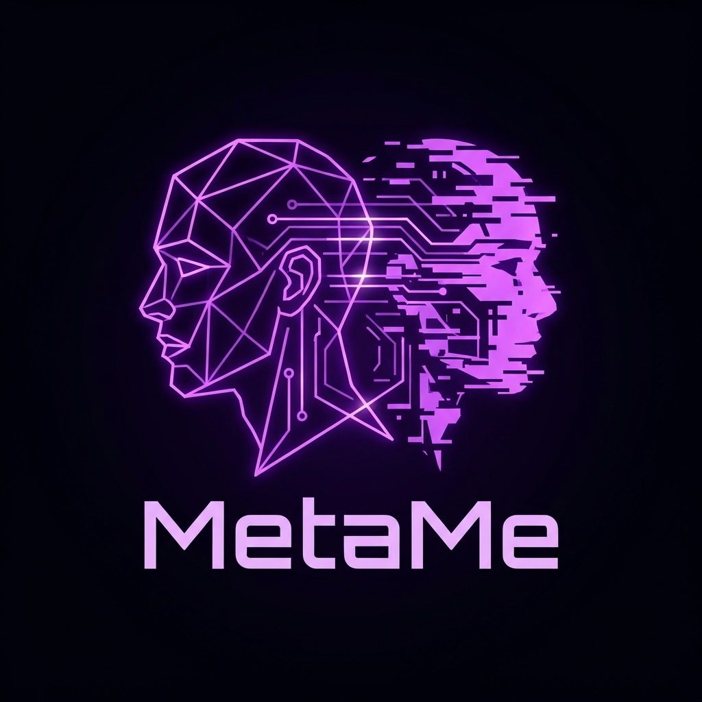

# MetaMe

<p align="center">
  
</p>

<p align="center">
  <a href="https://www.npmjs.com/package/metame-cli"></a>
  <a href="https://www.npmjs.com/package/metame-cli"></a>
  <a href="https://github.com/Yaron9/MetaMe/blob/main/LICENSE"></a>
</p>

<p align="center">
  <a href="./README.md">English</a> | <a href="./README中文版.md">中文</a>
</p>

> **Claude Code that knows you — and works from your phone.**

MetaMe turns Claude Code into a persistent AI that remembers how you think, runs on your Mac 24/7, and takes commands from your phone via Telegram or Feishu.

One command. No cloud. Your machine, your data.

```bash
# One-liner (installs Node.js, Claude Code, and MetaMe automatically):
curl -fsSL https://raw.githubusercontent.com/Yaron9/MetaMe/main/install.sh | bash

# Or if you already have Node.js:
npm install -g metame-cli && metame
```

---

> ### 🚀 v1.4.18 — Multi-User ACL + Session Context Preview
>
> - **Multi-user permission system**: role-based ACL (admin / member / stranger) — share your bots with teammates without giving them full access. Manage users with `/user` commands.
> - **Session context preview**: `/resume` and `/sessions` now show the last message snippet so you know exactly what to pick up.
> - **Team Task protocol**: multi-agent task board for cross-agent collaboration. Agents can dispatch and track tasks across workspaces.
> - **Layered Memory Architecture**: three-layer memory (long-term facts, session summaries, session index) — all automatic.
> - **Unix Socket IPC**: dispatch latency <100ms.
>
> Zero configuration. It just works.

---

## What It Does

### 1. Knows You Across Every Project

Claude Code forgets you every time you switch folders. MetaMe doesn't.

A cognitive profile (`~/.claude_profile.yaml`) follows you everywhere — not just facts like "user prefers TypeScript", but *how you think*: your decision style, cognitive load preferences, communication patterns. It learns silently from your conversations via background distillation, no effort required.

```
$ metame
🧠 MetaMe: Distilling 7 moments in background...
🧠 Memory: 42 facts · 87 sessions tagged
Link Established. What are we building?
```

### 2. Full Claude Code From Your Phone

Your Mac runs a daemon. Your phone sends messages via Telegram or Feishu. Same Claude Code engine — same tools, same files, same session.

```
You (phone):  Fix the auth bug in api/login.ts
Claude:       ✏️ Edit: api/login.ts
              💻 Bash: npm test
              ✅ Fixed. 3 tests passing.
```

Start on your laptop, continue on the train. `/stop` to interrupt, `/undo` to rollback, `/mac check` for macOS automation diagnostics, and `/sh ls` for raw shell access when everything else breaks.

### 3. Layered Memory That Works While You Sleep

MetaMe's memory system runs automatically in the background — no prompts, no manual saves.

**Layer 1 — Long-term Facts**
When you go idle, MetaMe runs memory consolidation: extracts key decisions, patterns, and knowledge from your sessions into a persistent facts store. These are semantically recalled on every session start.

**Layer 2 — Session Continuity**
Resuming a conversation after 2+ hours? MetaMe injects a brief summary of what you were working on last time — so you pick up where you left off without re-explaining context.

**Layer 3 — Session Index**
Every session gets tagged with topics and intent. This powers future session routing: when you reference "that thing we worked on last week", MetaMe knows where to look.

```
[Background, while you sleep]
idle 30min → memory consolidation triggered
  → session_tags.json updated (topics indexed)
  → facts extracted → ~/.metame/memory.db
  → session summary cached → daemon_state.json

[Next morning, when you resume]
"continue from yesterday" →
  [上次对话摘要] Auth refactor, decided on JWT with
  refresh token rotation. Token expiry set to 15min.
```

### 4. Heartbeat — A Programmable Nervous System

Most AI tools react when you talk to them. MetaMe keeps running while you sleep.

The heartbeat system is three-layered:

**Layer 0 — Kernel (always on, zero config)**
Built into the daemon. Runs every 60 seconds regardless of what's in your config:
- Drains the dispatch queue (IPC messages from other agents)
- Tracks daemon aliveness and rotates logs
- Detects when you go idle → generates session continuity summaries

**Layer 1 — System Evolution (built-in defaults)**
Three tasks shipped out of the box. They are precondition-gated and run only when useful:

```yaml
- cognitive-distill   # 4h · has signals? → distill preferences into profile
- memory-extract      # 4h · scan sessions → extract long-term facts + topic tags
- skill-evolve        # 6h · has signals? → evolve skills from task outcomes
```

`precondition` guards mean zero tokens burned when there's nothing to process.

**Layer 2 — Your Tasks (fully customizable)**
Anything you want Claude to do on a schedule, per project, with push notifications:

```yaml
projects:
  my_blog:
    heartbeat_tasks:
      - name: "daily-draft"
        prompt: "Research top AI news and write an article"
        at: "09:30"
        days: "weekdays"
        model: "sonnet"
        notify: true

heartbeat:
  tasks:
    - name: "morning-brief"
      prompt: "Summarize my git activity from yesterday"
      at: "09:00"
      notify: true
```

Chain skills into multi-step workflows — research → write → publish — fully automated:

```yaml
    - name: "daily-content"
      type: "workflow"
      steps:
        - skill: "deep-research"
          prompt: "Top 3 AI news today"
        - skill: "tech-writing"
          prompt: "Write an article from the research above"
        - skill: "wechat-publisher"
          prompt: "Publish it"
```

Task options: `interval` (every N seconds/minutes/hours/days), `at` (fixed local `HH:MM`), `days` (optional day filter), `require_idle` (defer when you're active, retry on next heartbeat tick), `precondition` (shell guard — skip if false, zero tokens), `notify` (push result to phone), `model`, `cwd`, `allowedTools`, `timeout`.

### 5. Skills That Evolve Themselves

MetaMe has a living skill ecosystem. Skills aren't static configs — they grow.

- **Auto-discovery**: When a task fails or a capability is missing, MetaMe's skill-scout automatically searches for, installs, and verifies new skills.
- **Learning by watching**: Can't automate a complex browser workflow? Say "我来演示" and MetaMe records your actions, then converts them into a reusable skill.
- **Post-task evolution**: After every significant task, the skill-evolution-manager reviews what worked and what didn't, then surgically updates the relevant skills with new knowledge.
- **Composable**: Skills chain together in workflows. A `deep-research` skill feeds into `tech-writing`, which feeds into `wechat-publisher` — each one improving from real usage.

```
Task fails → skill-scout finds a skill → installs → retries → succeeds
                                                      ↓
                                      skill-evolution-manager
                                      updates skill with lessons learned
```

---

## Quick Start

```bash
# One-liner installer (handles Node.js, Claude Code, and MetaMe):
curl -fsSL https://raw.githubusercontent.com/Yaron9/MetaMe/main/install.sh | bash

# Or manually if you already have Node.js ≥ 18:
npm install -g metame-cli && metame
```

**3 minutes to full setup:**

| Step | Command | What happens |
|------|---------|-------------|
| 1. Install & profile | `metame` | First run: cognitive interview → builds `~/.claude_profile.yaml` |
| 2. Connect phone | Follow the setup wizard | Bot token + app credentials → `~/.metame/daemon.yaml` |
| 3. Start daemon | `metame start` | Background daemon launches, bot goes online |
| 4. Auto-start | `metame daemon install-launchd` | Survives reboot + crash recovery |

**Create your first Agent:**

1. Create a group chat in Telegram/Feishu, add your bot
2. Send `/agent bind <name>` in the group (e.g. `/agent bind personal`)
3. Pick a working directory from the buttons, or type a path directly — non-existent directories are created automatically → done

> Want more Agents? Repeat: new group → add bot → `/agent bind <name>`. Each group = independent AI workspace.

---

## Core Capabilities

| Capability | What It Does |
|-----------|-------------|
| **Cognitive Profile** | Learns how you think across sessions. Schema-enforced, 800-token budget, auto-distilled via Haiku. Lock any value with `# [LOCKED]`. |
| **Layered Memory** | Three-tier memory: long-term facts (semantic recall), session summaries (continuity bridge), session index (topic tags). All automatic. |
| **Mobile Bridge** | Full Claude Code via Telegram/Feishu. Stateful sessions, file transfer both ways, real-time streaming status. |
| **Skill Evolution** | Self-healing skill system. Auto-discovers missing skills, learns from browser recordings, evolves after every task. Skills get smarter over time. |
| **Heartbeat System** | Three-layer programmable nervous system. Layer 0 kernel always-on (zero config). Layer 1 system evolution built-in (distill + memory + skills). Layer 2 your custom scheduled tasks with `require_idle`, `precondition`, `notify`, workflows. |
| **Multi-Agent** | Multiple projects with dedicated chat groups. `/agent bind` for one-tap setup. True parallel execution. |
| **Browser Automation** | Built-in Playwright MCP. Browser control out of the box for every user. |
| **Provider Relay** | Route through any Anthropic-compatible API. Use GPT-4, DeepSeek, Gemini — zero config file mutation. |
| **Metacognition** | Detects behavioral patterns (decision style, comfort zones, goal drift) and injects mirror observations. Zero extra API cost. |
| **Multi-User ACL** | Role-based permission system (admin / member / stranger). Share bots with teammates safely. Dynamic user management via `/user` commands with hot-reload config. |
| **Team Task** | Multi-agent task board for cross-agent collaboration. Agents can create, assign, and track tasks across workspaces. N-agent session scoping for parallel team workflows. |
| **Emergency Tools** | `/doctor` diagnostics, `/mac` macOS control helpers, `/sh` raw shell, `/fix` config restore, `/undo` git-based rollback. |

## Defining Your Agents

Agent configs live in `~/.metame/daemon.yaml` — local only, never uploaded to npm or Git.

### From your phone (recommended)

The easiest way. Open any Telegram/Feishu group and use the `/agent` wizard:

| Command | What it does |
|---------|-------------|
| `/agent new` | Step-by-step wizard: pick a directory → name the agent → describe its role. MetaMe writes the role into `CLAUDE.md` automatically. You can also type a path directly in chat — if it doesn't exist, MetaMe creates it for you. |
| `/agent bind <name> [dir]` | Quick bind: register this group as a named agent, optionally set working directory. |
| `/agent list` | Show all configured agents. |
| `/agent edit` | Update the current agent's role description (rewrites its `CLAUDE.md` section). |
| `/agent reset` | Remove the current agent's role section. |

Example flow:
```
You:     /agent new
Bot:     Please select a working directory:
         📁 ~/AGI   📁 ~/projects   📁 ~/Desktop
You:     ~/AGI/MyProject/NewDir
Bot:     ✅ 已新建目录：~/AGI/MyProject/NewDir
         What should we name this agent?
You:     小美
Bot:     Describe 小美's role and responsibilities:
You:     Personal assistant. Manages my calendar, drafts messages, and tracks todos.
Bot:     ✅ Agent「小美」created. CLAUDE.md updated with role definition.
```

You can tap a button to pick an existing directory, or type any path directly in chat. If the path doesn't exist, it's created automatically. All entry points (`/agent new` wizard and `/agent bind`) validate that the directory is real before saving.

### From config file (for power users)

```yaml
# ~/.metame/daemon.yaml
projects:
  assistant:                      # project key — used by dispatch_to
    name: "Personal Assistant"
    icon: "💅"
    color: "blue"
    cwd: "~/AGI/MyAssistant"
    nicknames: ["小美", "助理"]
    heartbeat_tasks: []

  coder:
    name: "Backend Engineer"
    icon: "🛠"
    color: "orange"
    cwd: "~/projects/backend"
    heartbeat_tasks:
      - name: "daily-review"
        prompt: "Review yesterday's commits and flag any issues"
        at: "20:30"
        days: [mon, tue, wed, thu, fri]
        notify: true

feishu:
  chat_agent_map:
    oc_abc123: assistant          # this group → assistant agent
    oc_def456: coder              # this group → coder agent
```

All agents share your cognitive profile (`~/.claude_profile.yaml`) — they all know who you are. Each runs in its own `cwd` with its own Claude session, in parallel.

**Dispatch between agents** (from Claude or a heartbeat task):

```bash
~/.metame/bin/dispatch_to assistant "Schedule tomorrow's standup"
~/.metame/bin/dispatch_to coder "Run the test suite and report results"
```

## Mobile Commands

| Command | Action |
|---------|--------|
| `/last` | Resume most recent session |
| `/new` | Start new session (project picker) |
| `/resume` | Pick from session list |
| `/stop` | Interrupt current task (ESC) |
| `/undo` | Show recent messages as buttons — tap to roll back context + code to before that message |
| `/undo <hash>` | Roll back to a specific git checkpoint |
| `/list` | Browse & download project files |
| `/model` | Switch model (sonnet/opus/haiku) |
| `/agent bind <name> [dir]` | Register group as dedicated agent |
| `/mac` | macOS control helper: permissions check/open + AppleScript/JXA execution |
| `/sh <cmd>` | Raw shell — bypasses Claude |
| `/memory` | Memory stats: fact count, session tags, DB size |
| `/memory <keyword>` | Search long-term facts by keyword |
| `/doctor` | Interactive diagnostics |
| `/user add <open_id>` | Add a user (admin only) |
| `/user role <open_id> <admin\|member>` | Set user role |
| `/user list` | List all configured users |
| `/user remove <open_id>` | Remove a user |
| `/sessions` | Browse recent sessions with last message preview |
| `/task` | Team task board — create, list, and assign tasks across agents |

## How It Works

```
┌─────────────┐     Telegram/Feishu      ┌──────────────────────────────┐
│  Your Phone  │ ◄──────────────────────► │   MetaMe Daemon              │
└─────────────┘                           │   (your Mac, 24/7)           │
                                          │                              │
                                          │   ┌──────────────┐           │
                                          │   │ Claude Code   │           │
                                          │   │ (same engine) │           │
                                          │   └──────────────┘           │
                                          │                              │
                                          │   ~/.claude_profile          │
                                          │   (cognitive layer)          │
                                          │                              │
                                          │   ~/.metame/memory.db        │
                                          │   session_tags.json          │
                                          │   (memory layer)  ← NEW      │
                                          └──────────────────────────────┘
                                                       ↑
                                          idle mode → summaries + background memory tasks
                                                      (automatic, precondition-gated)
```

- **Profile** (`~/.claude_profile.yaml`): Your cognitive fingerprint. Injected into every Claude session via `CLAUDE.md`.
- **Daemon** (`scripts/daemon.js`): Background process handling Telegram/Feishu messages, heartbeat tasks, Unix socket dispatch, and idle/sleep transitions.
- **Distillation** (`scripts/distill.js`): Heartbeat task (default 4h, signal-gated) that updates your profile.
- **Memory Extract** (`scripts/memory-extract.js`): Heartbeat task (default 4h, idle-gated) that extracts long-term facts and session topic tags.
- **Session Summarize** (`scripts/session-summarize.js`): Generates a 2-4 sentence summary for idle sessions. Injected as context when resuming after a 2h+ gap.

## Security

- All data stays on your machine. No cloud, no telemetry.
- `allowed_chat_ids` whitelist — unauthorized users get a one-step `/agent bind` guide instead of silent rejection.
- `operator_ids` for shared groups — non-operators get read-only mode.
- `~/.metame/` directory is mode 700.
- Bot tokens stored locally, never transmitted.

## Performance

| Metric | Value |
|--------|-------|
| Daemon memory (idle) | ~100 MB RSS — standard Node.js process baseline |
| Daemon CPU (idle, between heartbeats) | ~0% — event-loop sleeping |
| Cognitive profile injection | ~800 tokens/session (0.4% of 200k context) |
| Dispatch latency (Unix socket) | <100ms |
| Memory consolidation (per session) | ~1,500–2,000 tokens input + ~50–300 tokens output (Haiku) |
| Session summary (per session) | ~400–900 tokens input + ≤250 tokens output (Haiku) |
| Mobile commands (`/stop`, `/list`, `/undo`) | 0 tokens |

> Both memory consolidation and session summarization run in the background via Haiku (`--model haiku`). Input is capped by code: skeleton text ≤ 3,000 chars, summary output ≤ 500 chars. Neither runs per-message — memory consolidation follows heartbeat schedule with idle/precondition guards, and summaries trigger once per idle session on sleep-mode transitions.

## Plugin

Install directly into Claude Code without npm:

```bash
claude plugin install github:Yaron9/MetaMe/plugin
```

Includes: cognitive profile injection, daemon (Telegram/Feishu), heartbeat tasks, layered memory, all mobile commands, slash commands (`/metame:evolve`, `/metame:daemon`, `/metame:refresh`, etc.).

**One key difference from the npm CLI:** the plugin daemon starts when you open Claude Code and stops when you close it. It does not run 24/7 in the background. For always-on mobile access (receiving messages while Claude Code is closed), use the npm CLI with `metame daemon install-launchd`.

Use the plugin if you prefer not to install a global npm package and only need mobile access while Claude Code is open. Use the npm CLI (`metame-cli`) for 24/7 daemon, the `metame` command, and first-run interview.

## License

MIT
