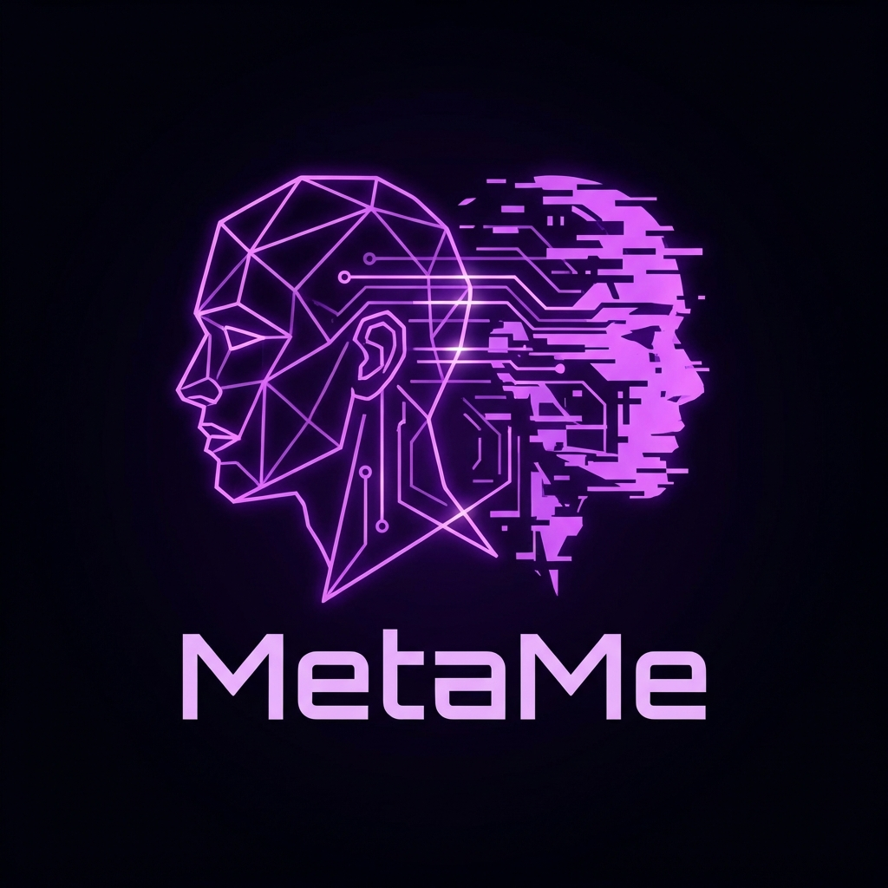

# 🔮 MetaMe

<p align="center">
  
</p>

> **Claude Code 的"认知画像"层 (The Cognitive Profile Layer)**
>
> *懂你怎么想，陪你到处走。*

## 📖 简介

**Claude Code** 很强大，但有两个痛点：

1. **项目失忆症** — 切换文件夹，它就忘了你是谁。你的沟通风格、编码偏好、约束条件——全没了。每个项目都要从头来过。

2. **被困在电脑前** — 离开电脑，工作就中断。你没法在手机上继续那个调试会话，没法在地铁上、床上、排队时跟 Claude 继续 vibe。

**MetaMe** 全都解决——还有更多：

**🧠 认知画像** — 一个持久的"全局大脑"（`~/.claude_profile.yaml`），跟随你穿梭于每个项目。不同于 ChatGPT/Claude 的内置记忆（存的是"用户住在哪里"这种*事实*），MetaMe 捕捉的是*你怎么想*——你的决策风格、认知负荷偏好、沟通特征。它不是记忆系统，是你的**认知镜像**。

**📱 移动桥接** — 手机端完整 Claude Code，通过 Telegram 或飞书。同样的工具、同样的文件、同样的对话历史。在电脑上开始，随处继续。`/cd last` 让你精准同步到之前的位置。

**🔔 远程唤醒** — Daemon 在你电脑后台运行。手机发条消息，就能唤醒电脑上的 Claude Code 干活——编辑文件、跑命令、提交代码——即使你不在电脑前。

**📂 文件互传** — 电脑传手机（让 Claude 发送任何项目文件）。手机传电脑（直接在聊天里发附件）。双向无缝。

**⏰ 心跳任务** — 定时自动运行 Claude。每日总结、自动化工作流、多步骤 Skill 链——全在你的电脑上跑，结果推送到手机。

## ✨ 核心特性

* **🧠 全局大脑 (`~/.claude_profile.yaml`)：** 唯一的、可移植的真理来源——你的身份、认知特征和偏好跟随你穿梭于每个项目。
* **🧬 认知进化引擎：** 三条学习通道：(1) **被动蒸馏**——静默捕获消息，启动时用 Haiku 提取认知特征；(2) **手动进化**——`!metame evolve` 显式教学；(3) **置信度门控**——强指令（"以后一律"/"always"）直写，普通观察需 3+ 次一致观察才晋升。Schema 白名单（41 字段、5 层 Tier、800 token 预算）防止膨胀。
* **🛡️ 自动锁定：** 任何值标记 `# [LOCKED]` 即为宪法，永不被自动修改。
* **🪞 元认知层 (v1.3)：** MetaMe 不只观察你*说什么*，还观察你*怎么想*。行为模式检测复用现有的 Haiku 蒸馏调用（零额外成本），跨会话追踪决策模式、认知负荷、舒适区和回避主题。当持续模式出现时，注入一行镜像观察——例如"你倾向于拖延测试直到被迫"——每个模式 14 天冷却。反思提示仅在触发条件下出现（每 7 次蒸馏或连续 3 次舒适区）。所有注入逻辑在 Node.js 中运行，Claude 只收到已决策的指令。
* **📱 远程 Claude Code (v1.3)：** 手机端完整 Claude Code 体验，支持 Telegram 和飞书。有状态会话（`--resume`）——和终端一样的对话历史、工具调用、文件编辑。可点击按钮选择项目/会话/目录，支持 macOS launchd 自启动。
* **🔄 工作流引擎 (v1.3)：** 将多步骤 Skill 链定义为心跳任务。每个工作流在单个 Claude Code 会话中通过 `--resume` 运行，上一步的输出自动成为下一步的上下文。示例：`deep-research` → `tech-writing` → `wechat-publisher`——全自动内容流水线。

## 🛠 前置要求

MetaMe 是 **Claude Code** 的外壳。你必须先安装 Node.js 和官方的 Claude Code 工具。

1. **Node.js**: 版本 14 或更高。
2. **Claude Code**: 确保 `claude` 命令可用且已登录。

## 📦 安装

通过 NPM 全局安装：

```bash
npm install -g metame-cli
```

*(Mac/Linux 如遇权限错误，使用 `sudo npm install -g metame-cli`)*

## 🚀 使用指南

忘掉 `claude` 命令吧。从现在起，只需输入：

```bash
metame
```

### 初次运行：创世纪

当你第一次运行 MetaMe 时，它会检测到你的档案为空，进入 **校准模式**：

1. 它会询问你的 **代号**（昵称）。
2. 它会开启一场 **深度认知访谈**，探索你的天赋领域、思维模式和潜在焦虑。
3. **请务必诚实**：它是一面镜子。你越坦诚（即便是关于你的恐惧），它就越能成为你的完美分身。
4. 完成后，它会保存你的"源代码"并启动 Claude。

### 日常工作流

1. `cd` 进入任何项目文件夹。
2. 运行 `metame`。
3. Claude 启动并立即识别你。
4. 开始写代码。MetaMe 会在后台自动管理上下文。

### 认知进化

MetaMe 通过两条路径认识你：

**自动（零操作）：** 全局 Hook 捕获消息，下次启动时 Haiku 在后台蒸馏认知特征。强指令（"以后一律"/"always"）直接写入；普通观察需 3+ 次一致观察才晋升。所有写入经过 Schema 验证（41 字段，800 token 预算）。启动时你会看到：

```
🧠 MetaMe: Distilling 7 moments in background...
```

**手动：** 直接更新某个特征：

```bash
metame set-trait status.focus "学习 Rust"
metame evolve "我更喜欢函数式编程"
```

**情境记忆（关键帧，非全量日志）：** MetaMe 不是记忆系统，但它捕获两类纯性格特征无法替代的经验"关键帧"：

* **避坑指南** (`context.anti_patterns`, 最多 5 条)：跨项目的失败教训——例如*"Promise.all 单点失败会全部 reject，应使用 Promise.allSettled"*。60 天自动过期。防止 AI 在不同会话中重复犯同样的错误。
* **里程碑** (`context.milestones`, 最多 3 条)：最近完成的关键节点——例如*"MetaMe v1.3 已发布"*。提供连续性，让 Claude 知道你进展到哪了，无需你每次复述。

**防偏差机制：** 单次观察 ≠ 特征，矛盾信号追踪而非盲目覆盖，pending 特征 30 天无新观察自动过期，上下文字段过期自动清理。

**元认知控制：**

```bash
metame quiet            # 静默镜像观察和反思提示 48 小时
metame insights         # 查看已检测到的行为模式
metame mirror on|off    # 开关镜像注入
```

### 远程 Claude Code —— Telegram & 飞书（v1.3）

手机端完整 Claude Code——有状态会话，支持对话历史、工具调用、文件编辑。同时支持 Telegram 和飞书。

**配置：**

```bash
metame daemon init                    # 创建配置 + 设置指引
```

编辑 `~/.metame/daemon.yaml`：

```yaml
telegram:
  enabled: true
  bot_token: "你的BOT_TOKEN"           # 从 @BotFather 获取
  allowed_chat_ids:
    - 123456789                        # 你的 Telegram chat ID

feishu:
  enabled: true
  app_id: "你的APP_ID"                # 从飞书开发者后台获取
  app_secret: "你的APP_SECRET"
  allowed_chat_ids: []                # 空 = 允许所有
```

**启动守护进程：**

```bash
metame daemon start                   # 后台运行
metame daemon status                  # 查看状态
metame daemon logs                    # 查看日志
metame daemon stop                    # 停止
metame daemon install-launchd         # macOS 自启动（开机自启 + 崩溃重启）
```

**会话命令（Telegram 和飞书均支持可点击按钮）：**

| 命令 | 说明 |
|------|------|
| `/last` | **快速恢复** — 优先当前目录最近 session，否则全局最近 |
| `/new` | 新建会话——从按钮列表选择项目目录 |
| `/new <path> [name]` | 在指定路径新建会话，可选命名 |
| `/resume` | 恢复会话——可点击列表，显示会话名 + 实时时间戳 |
| `/resume <name>` | 按名称恢复（支持模糊匹配，跨项目搜索） |
| `/continue` | 继续电脑上最近一次终端会话 |
| `/name <name>` | 为当前会话命名（与桌面端 `/rename` 同步） |
| `/cd` | 切换工作目录——带目录浏览器 |
| `/cd last` | **同步到电脑** — 跳转到最近 session 所在目录 |
| `/session` | 查看当前会话信息 |

直接打字即可对话——每条消息都在同一个 Claude Code 会话中，保持完整上下文。

**原理：**

每个聊天绑定一个持久会话，通过 `claude -p --resume <session-id>` 调用。这是和终端完全相同的 Claude Code 引擎——相同的工具（文件编辑、bash、代码搜索）、相同的对话历史。你可以在电脑上开始工作，手机上 `/resume` 继续，反之亦然。

**实时状态显示 (v1.3.7)：** 手机上实时看到 Claude 的工作进度：

```
📖 Read: 「config.yaml」
✏️ Edit: 「daemon.js」
💻 Bash: 「git status」
```

**文件互传 (v1.3.8)：** 手机和电脑之间无缝传输文件。

*电脑 → 手机（下载）：* 让 Claude 把项目文件发到手机：

```
你: 把 report.md 发过来
Claude: 请查收~!
        [📎 report.md]  ← 点击下载
```

支持文档、音频、图片等任意文件。点击按钮即可下载，链接 30 分钟有效。

*手机 → 电脑（上传）：* 直接发送文件到项目目录：

```
[📎 你发送了一个 PDF、图片或任意文件]
Claude: 📥 已保存: document.pdf
        文件在项目的 upload/ 文件夹中。
```

上传的文件保存在 `<项目目录>/upload/`。Claude 不会自动读取大文件——需要时再让它处理。

- **Telegram:** 开箱即用
- **飞书:** 需要在应用权限中添加 `im:resource` + `im:message`

**其他命令：**

| 命令 | 说明 |
|------|------|
| `/status` | 守护进程状态 + 画像摘要 |
| `/tasks` | 列出心跳任务 |
| `/run <名称>` | 立即执行某个任务 |
| `/budget` | 今日 token 用量 |
| `/quiet` | 静默镜像/反思 48 小时 |
| `/reload` | 手动重载 daemon.yaml（文件变化时也会自动重载） |

**心跳任务：**

在 `daemon.yaml` 中定义定时任务：

```yaml
heartbeat:
  tasks:
    - name: "morning-news"
      prompt: "抓取今天AI领域的重要新闻，整理成3条摘要。"
      interval: "24h"
      model: "haiku"
      notify: true
      precondition: "curl -s -o /dev/null -w '%{http_code}' https://news.ycombinator.com | grep 200"
```

* `precondition`：预检命令——输出为空则跳过，零 token 消耗。
* `type: "script"`：直接运行本地脚本，不走 `claude -p`。
* `notify: true`：结果推送到 Telegram/飞书。

**工作流任务**（多步骤 Skill 链）：

```yaml
heartbeat:
  tasks:
    - name: "daily-wechat"
      type: "workflow"
      interval: "24h"
      model: "sonnet"
      notify: true
      steps:
        - skill: "deep-research"
          prompt: "今天 AI 领域 3 条重要新闻"
        - skill: "tech-writing"
          prompt: "基于上面的调研结果写一篇公众号文章"
        - skill: "wechat-publisher"
          prompt: "发布文章"
          optional: true
```

每个步骤在同一个 Claude Code 会话中运行。上一步的输出自动成为下一步的上下文。`optional: true` 表示该步骤失败不中断整个工作流。

**自动重载：** 守护进程监听 `daemon.yaml` 的变化。当 Claude（或你）编辑配置文件时，守护进程自动重载——无需重启或手动发 `/reload`。重载后推送通知确认。

**Token 效率：**

* 轮询、斜杠命令、目录浏览：**零 token**
* 有状态会话：和终端使用 Claude Code 成本相同
* 日 token 预算限额（默认 50000）
* Claude 调用间隔 10 秒冷却

**安全模型：**

* `allowed_chat_ids` 白名单——未授权用户静默忽略
* 不使用 `--dangerously-skip-permissions`——标准 `-p` 模式权限
* `~/.metame/` 目录权限 700
* Bot token 仅存本地，不外传

### 热刷新 (Refresh)

如果你更新了个人档案，或者需要修复断开的上下文连接，而**不想重启会话**：

*   **在 Claude 内部**：运行 `!metame refresh`
*   **在外部终端**：运行 `metame refresh`

这会立即将你最新的档案重新注入 `CLAUDE.md`。

## ⚙️ 配置与"全局大脑"

你的个人档案存储在你用户主目录下的一个隐藏 YAML 文件中。

**位置：** `~/.claude_profile.yaml`

你可以手动编辑此文件来更新你的状态或锁定你的价值观。

**档案示例（v2 Schema）：**

```yaml
# === T1: 身份（锁定）===
identity:
  nickname: Neo              # [LOCKED]
  role: Senior Architect
  locale: en-US              # [LOCKED]

# === T2: 核心特质（锁定）===
core_traits:
  crisis_reflex: Analysis    # [LOCKED]
  flow_trigger: Debugging    # [LOCKED]
  learning_style: Hands-on   # [LOCKED]

# === T3: 偏好（自动学习）===
preferences:
  code_style: concise
  communication: direct
  explanation_depth: brief_rationale

# === T3b: 认知（自动学习，缓慢变化）===
cognition:
  decision_style: analytical
  info_processing:
    entry_point: big_picture
    preferred_format: structured
  cognitive_load:
    chunk_size: medium
    preferred_response_length: moderate

# === T4: 上下文（自动覆写）===
context:
  focus: "重构遗留代码"
  energy: high
  milestones:
    - "MetaMe v1.3 已发布"
  anti_patterns:
    - text: "Promise.all 单点失败全部 reject，用 Promise.allSettled"
      added: "2026-01-20"

# === T5: 进化（系统管理）===
evolution:
  distill_count: 12
  last_distill: "2026-01-30T10:00:00Z"
```

* **T1-T2** 标记 `# [LOCKED]` 的字段永远不会被自动修改。
* **T3** 字段通过置信度门槛自动学习。
* **T4** 字段随上下文变化自由覆写。
* **T5** 字段由蒸馏系统管理。

### 档案迁移（v1 → v2）

如果你有旧版 v1 档案，运行迁移脚本：

```bash
node ~/.metame/migrate-v2.js --dry-run   # 预览变更
node ~/.metame/migrate-v2.js             # 执行迁移（自动创建备份）
```

## 🗑️ 卸载

如果你希望从系统中彻底移除 MetaMe：

### 1. 移除软件包

```bash
npm uninstall -g metame-cli
```

### 2. 移除全局大脑（可选）

```bash
rm ~/.claude_profile.yaml
```

### 3. 停止守护进程

```bash
metame daemon stop
launchctl unload ~/Library/LaunchAgents/com.metame.daemon.plist 2>/dev/null
rm -f ~/Library/LaunchAgents/com.metame.daemon.plist
```

### 4. 移除被动蒸馏数据（可选）

```bash
rm -rf ~/.metame
```

### 5. 移除信号捕获 Hook（可选）

MetaMe 在 `~/.claude/settings.json` 中安装了全局 Hook。移除方式：

```bash
node -e "
const fs = require('fs');
const p = require('os').homedir() + '/.claude/settings.json';
const s = JSON.parse(fs.readFileSync(p, 'utf8'));
if (s.hooks) { delete s.hooks.UserPromptSubmit; }
fs.writeFileSync(p, JSON.stringify(s, null, 2));
console.log('Hook 已移除。');
"
```

### 6. 清理项目文件（可选）

MetaMe 会在项目的 `CLAUDE.md` 文件头部添加一段协议。恢复原状：用文本编辑器删除以 `## 🧠 SYSTEM KERNEL` 开头的块。

## ⚡ 性能与成本

> "这会吃掉我的上下文窗口吗？"

**简短回答：不会。它甚至通过减少废话为你省钱。**

* **上下文占用**：整个 MetaMe 内核 + 你的完整档案仅占用 **约 800-1000 tokens**。
* **占比**：在 Claude 的 200k 上下文窗口中，这仅占 **0.5%**。
* **投资回报**：通过预加载你的完整背景，它避免了每个新会话开头的"磨合期"和重复指令修正，而那些通常会浪费数千 tokens。
* **被动蒸馏成本**：信号捕获 Hook 是本地 Node.js 脚本（零 API 调用）。启动时的 Haiku 蒸馏仅处理少量过滤后的消息，通常只有几百 tokens，成本极低。

## ❓ 常见问题

**Q: 这会覆盖我原本的 `CLAUDE.md` 吗？**
A: 不会。它只是将元认知协议 *插入* 到你现有 `CLAUDE.md` 的最顶部。你原本的项目笔记会保持原样。

**Q: 我的数据会被发送给第三方吗？**
A: 不会。你的档案只保存在本地的 `~/.claude_profile.yaml` 中。MetaMe 只是将文本传递给官方的 Claude Code 工具。

## 📄 许可证

MIT License. 欢迎 Fork、修改并进化你自己的元认知系统。
